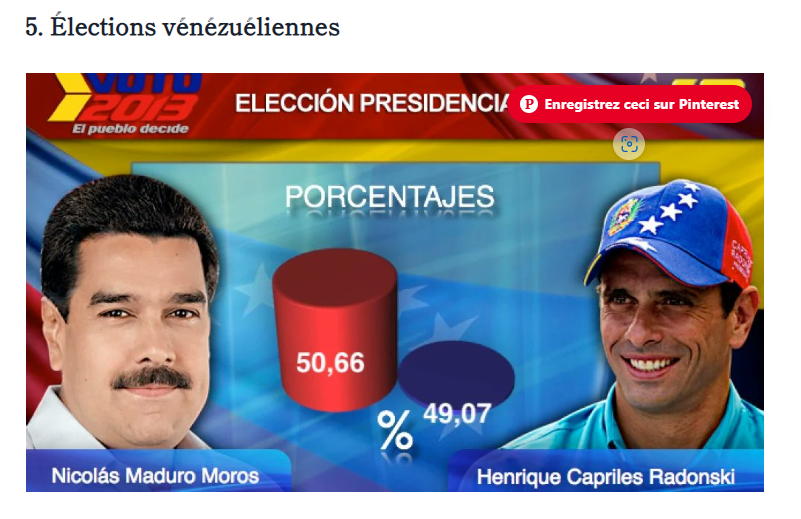
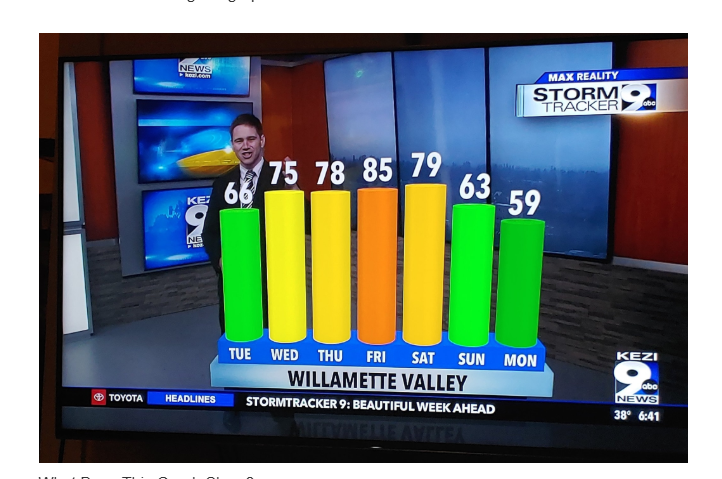

Le problème de cette visualisation est qu’elle donne une impression trompeuse de l’écart entre les deux candidats. Nicolás Maduro obtient 50,66 % contre 49,07 % pour Henrique Capriles, soit seulement 1,59 point d’écart, mais les cylindres en 3D amplifient visuellement cette différence. De plus, l’absence d’axe gradué rend difficile la comparaison des valeurs. Les effets 3D, les couleurs et les photos prennent également beaucoup de place et détournent l’attention des données. Le titre « PORCENTAJES » est trop vague et n’indique pas clairement ce que représentent les chiffres. Pour améliorer cette dataviz, il faudrait utiliser un graphique en 2D avec une échelle claire, des barres proportionnelles aux valeurs et un titre plus précis.

Le problème de cette visualisation est qu’elle représente les températures de manière trompeuse et peu précise. Les valeurs sont de 66 le lundi, 72 le mardi, 78 le mercredi, 85 le jeudi, 79 le vendredi et 59 le samedi. Pourtant, les cylindres en 3D et la perspective rendent les écarts difficiles à comparer. Par exemple, le cylindre correspondant à 85 semble visuellement plus bas que celui de 79, alors que 85 est une valeur plus élevée. De même, l’écart entre 78 et 85 est seulement de 7 unités, mais il paraît beaucoup plus important sur le graphique. Les valeurs de 72 et 78 semblent également assez éloignées visuellement. Aucun axe vertical ni aucune unité n’est indiqué, ce qui empêche de comprendre clairement l’échelle utilisée. Les couleurs changent pour chaque jour sans signification particulière et les éléments du décor prennent beaucoup de place. La visualisation est donc chargée et la représentation en 3D rend la comparaison des températures moins fiable.

Le principal problème de cette visualisation est l’utilisation d’un diagramme circulaire pour représenter des valeurs mesurées à différents moments. Les 34 % de 1997, les 43 % de l’année dernière et les 51 % d’aujourd’hui correspondent au même indicateur, mais à des périodes différentes. Elles ne représentent donc pas des parts d’un même total et ne doivent pas être additionnées pour atteindre 100 %. Le diagramme en secteurs donne ainsi une mauvaise interprétation des données en faisant croire qu’il s’agit de trois catégories composant un ensemble. La comparaison entre les différentes périodes est également moins claire.
