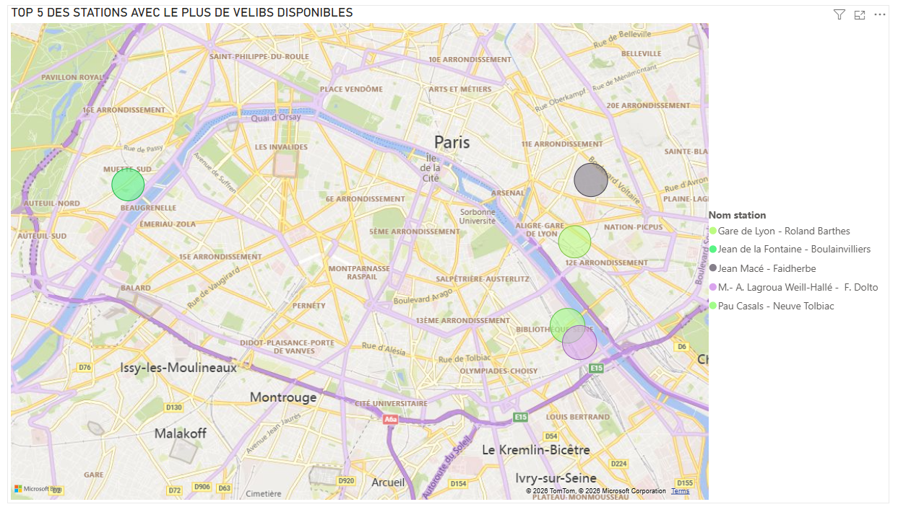
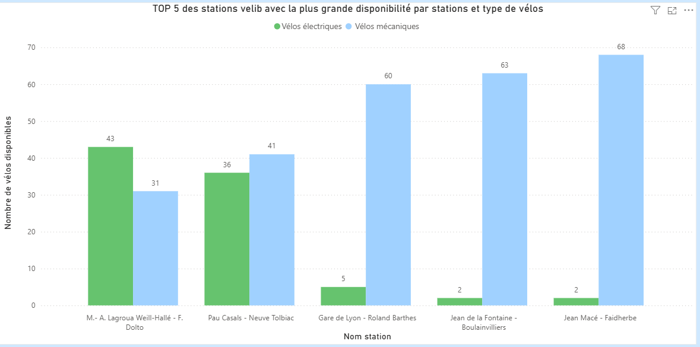

TP2 Mélissa Boudjelida , Lina Ferrat , Lilia Azizi

Problématique:
Où habiter pour avoir le plus de vélos Vélib’ disponibles à proximité, en fonction de ses préférences de type de vélo ?
Pour répondre à cette problématique, nous avons réalisé deux visualisations complémentaires à partir des données open data de Vélib’.
La première permet d’avoir une vision géographique de la disponibilité des vélos, tandis que la seconde permet d’analyser plus précisément le nombre et le type de vélos disponibles dans les stations identifiées.

Premier graphique : la carte des cinq stations les plus disponibles
La première visualisation est une carte représentant les cinq stations ayant le plus de vélos disponibles.
Cette représentation permet tout d’abord d’avoir une vision géographique des données. Chaque rond correspond à une station et plus le rond est grand, plus le nombre de vélos disponibles dans cette station est important.
On peut ainsi rapidement identifier les zones de Paris où l’offre Vélib’ est la plus importante. On retrouve notamment les stations M.-A. Lagroua Weill-Hallé – F. Dolto, Pau Casals – Neuve Tolbiac, Gare de Lyon – Roland Barthes, Jean de la Fontaine – Boula invilliers et Jean Macé – Faidherbe.
L’intérêt de cette visualisation est donc de répondre à une première question : où sont localisées les stations qui offrent le plus de vélos ?
Par exemple, si une personne souhaite choisir son futur lieu d’habitation en privilégiant l’accès aux Vélib’, elle peut utiliser cette carte pour identifier les secteurs dans lesquels elle aura potentiellement une station très bien approvisionnée à proximité.
Cependant, la taille des ronds permet surtout une comparaison visuelle. Pour connaître précisément le nombre de vélos et surtout leur type, il faut aller plus loin dans l’analyse. C’est justement l’objectif de notre deuxième graphique.

Deuxième graphique : la répartition entre vélos électriques et mécaniques
Le deuxième graphique est un histogramme à barres groupées. Il reprend exactement les cinq stations identifiées précédemment et détaille leur disponibilité selon le type de vélo.
La légende distingue les vélos électriques des vélos mécaniques.
Cette visualisation permet donc d’obtenir une information beaucoup plus précise que la carte.
On peut par exemple observer que la station M.-A. Lagroua Weill-Hallé – F. Dolto possède 43 vélos électriques et 31 vélos mécaniques, soit 74 vélos disponibles au total.
La station Pau Casals – Neuve Tolbiac possède quant à elle 36 vélos électriques et 41 vélos mécaniques, soit 77 vélos au total.
On observe ensuite un changement beaucoup plus marqué dans les autres stations. Gare de Lyon – Roland Barthes possède seulement 5 vélos électriques contre 60 vélos mécaniques, soit 65 vélos disponibles.
La station Jean de la Fontaine – Boula invilliers présente également une forte différence avec 2 vélos électriques contre 63 vélos mécaniques, soit 65 vélos.
Enfin, Jean Macé – Faidherbe possède 2 vélos électriques contre 68 vélos mécaniques, ce qui représente 70 vélos disponibles.
Cette comparaison permet donc de mettre en évidence une information importante : avoir beaucoup de vélos disponibles ne signifie pas nécessairement avoir beaucoup de vélos électriques.
Par exemple, une personne qui recherche simplement une station avec beaucoup de vélos pourrait être intéressée par Pau Casals – Neuve Tolbiac, avec 77 vélos disponibles. Mais une personne qui privilégie spécifiquement les vélos électriques pourrait davantage s’intéresser à M.-A. Lagroua Weill-Hallé – F. Dolto, qui possède 43 vélos électriques.

Lien entre les deux graphiques
Les deux visualisations apportent donc deux informations différentes mais complémentaires.
La carte répond à la question « où ? » : elle permet de localiser les cinq stations les plus importantes et de comparer visuellement leur disponibilité grâce à la taille des ronds.
Le graphique en barres répond davantage aux questions « combien ? » et « quel type ? » : il donne les valeurs précises et permet de distinguer les vélos électriques des vélos mécaniques.
Cette complémentarité permet d’avoir une analyse plus pertinente pour notre problématique.
Par exemple, si une personne souhaite habiter dans un secteur où elle pourra facilement trouver n’importe quel type de Vélib’, elle peut privilégier une station avec une disponibilité globale importante, comme Pau Casals – Neuve Tolbiac avec 77 vélos disponibles.
À l’inverse, si cette personne privilégie spécifiquement les vélos électriques, son choix peut être différent. La station M.-A. Lagroua Weill-Hallé – F. Dolto, avec 43 vélos électriques, apparaît alors comme particulièrement intéressante parmi les cinq stations étudiées.
On peut également remarquer que certaines stations présentent une très forte domination des vélos mécaniques. Jean Macé – Faidherbe, par exemple, possède 68 vélos mécaniques mais seulement 2 électriques. Il serait donc moins pertinent pour une personne dont le principal critère est la disponibilité des vélos électriques.

Conclusion
Grâce à ces deux visualisations, nous pouvons donc apporter une réponse plus précise à notre problématique.
L’analyse montre que le choix d’un lieu d’habitation ne dépend pas uniquement de la quantité totale de vélos disponibles, mais également de leur répartition par type.
La carte permet d’abord de repérer les zones où l’offre Vélib’ est la plus importante. Le graphique en barres permet ensuite d’affiner cette première analyse en fonction des préférences de l’utilisateur.
Ainsi, le meilleur endroit où habiter dépend du besoin de la personne : quelqu’un qui recherche principalement une forte disponibilité globale ne fera pas forcément le même choix qu’une personne qui privilégie les vélos électriques.
Notre analyse permet donc de passer d’une simple observation des données à une aide à la décision, en utilisant à la fois la localisation, la quantité disponible et le type de vélos proposés.
